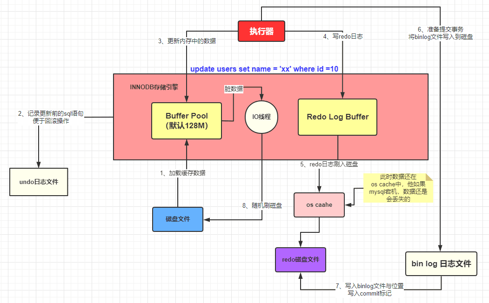

### 1、MySQL
#### 1.1 MySQL查询语句的执行过程
1、首先客户端与MySQL服务器建立连接，包括建立连接、管理连接、校验用户身份等
 
2、接着查询缓存，查询语句如果命中缓存则直接返回，否则继续执行（MySQL8.0已删除该模块）
 
3、通过解析器对查询语句进行词法分析、语法分析，然后构建语法树，方便后续模块读取表名、字段、语句类型
 
4、执行SQL，预处理阶段检查表或字段是否存在，优化阶段基于查询成本的考虑选择查询成本最小的执行计划，执行阶段根据执行计划执行SQL查询语句，从存储引擎读取记录，返回给客户端

#### 1.2 从准备更新一条数据到事务提交的流程描述
1、首先执行器根据MySQL的执行计划来查询数据，先是从缓存池中查询数据，如果没有就会去数据库中查询，如果查询到了就将其放到缓存池中
 
2、在数据被缓存到缓存池的同时，会写入undo log日志文件
 
3、更新的动作是在缓存池中完成的，同时会将更新后的数据添加到redo log buffer中
 
4、完成以后就可以提交事务，提交的同时会做以下三件事：
- 将redo log buffer中的数据刷入到redo log文件中
- 将本次操作记录写入到binlog文件中
- 将binlog文件名字和更新内容在binlog中的位置记录到redo log中，同时在redo log最后添加commit标记

### 2、Redis

### 3、MQ