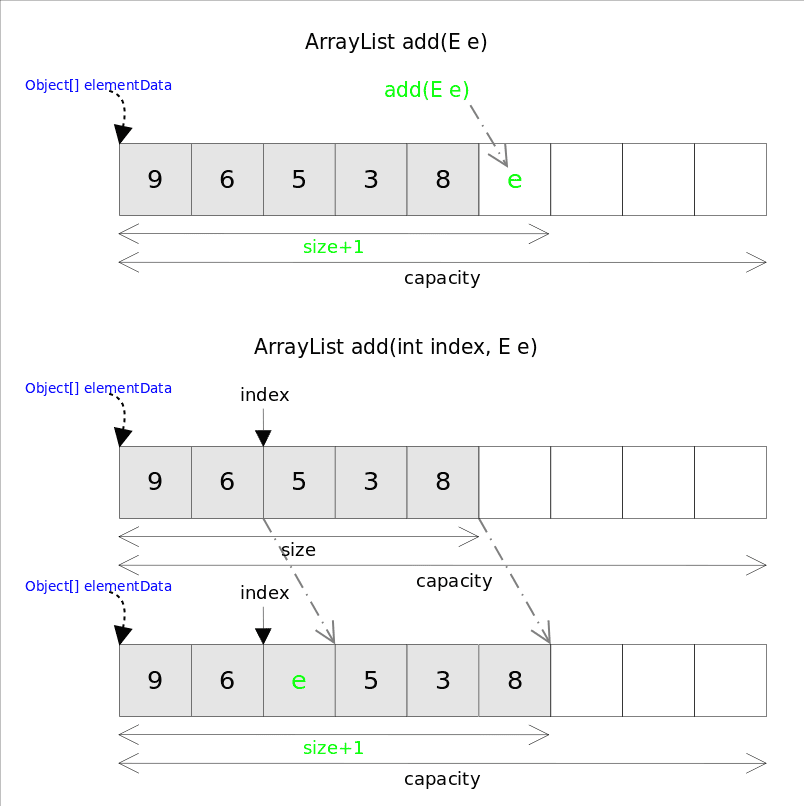

### 1.Java集合
#### 1.1 ArrayList扩容机制
每当向数组中添加元素时，都要去检查添加后元素的个数是否会超出当前数组的长度，如果超出数组将会进行扩容以满足添加数据的需求。数组扩容通过ensureCapacity()方法来实现。
<br>
数组进行扩容时，会将老数组中元素重新拷贝一份到新的数组中，每次数组容量的增长大约是其原容量的1.5倍。这种操作的代价是很高的，因此在实际使用时，我们应该尽量避免数组容量的扩张。当我们可预知要保存的元素的多少时，要在构造ArrayList实例时就指定其容量以避免数组扩容的发生。或者根据实际需求通过调用ensureCapacity方法来手动增加ArrayList的容量


#### 1.2 HashMap扩容机制
当HashMap中元素数量超过了负载因子(0.75)与当前容量的乘积，会触发扩容
<br>
扩容过程：
<br>
a. 当前容量翻倍
<br>
b. 重新计算hash，每个键的hash值会基于新的容量重新计算，并通过新的桶数组插入到相应的桶中
<br>
c. 元素迁移，在扩容过程中，所有的键值对会被重新计算位置并拷贝到新的桶数组，这需要遍历当前所有的链表或红黑树并重新插入到新位置

#### 1.3 为什么HashMap扩容为2的幂
a. 优化哈希计算，提高索引定位效率(位运算比%取模速度快)
<br>
HashMap计算key存储位置的公式为：
```
index = hash(key) & (capacity - 1)
```
b. 扩容时的优化，高低位拆分，优化数据迁移过程
<br>
JDK8中，HashMap扩容时采用高低位链表拆分，减少重新计算哈希的次数
<br>
传统计算扩容后索引方式需要对所有键值对重新计算hash & (newCapacity - 1)
<br>
优化方式：由于newCapacity = 2 * oldCapacity，新索引只取决于哈希值的某一位(oldCapacity对应的二进制位)
```
低位链表(index不变)：hash & oldCapacity == 0
高位链表(index + oldCapacity)：hash & oldCapacity != 0
```