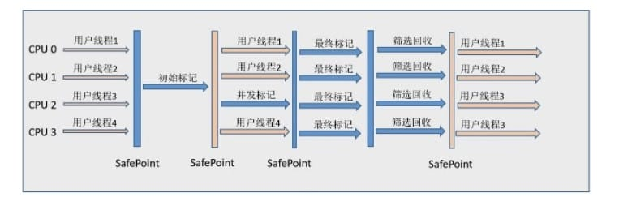

### 1 Java集合
#### 1.1 ArrayList扩容机制
每当向数组中添加元素时，都要去检查添加后元素的个数是否会超出当前数组的长度，如果超出数组将会进行扩容以满足添加数据的需求。数组扩容通过ensureCapacity()方法来实现。
<br>
数组进行扩容时，会将老数组中元素重新拷贝一份到新的数组中，每次数组容量的增长大约是其原容量的1.5倍。这种操作的代价是很高的，因此在实际使用时，我们应该尽量避免数组容量的扩张。当我们可预知要保存的元素的多少时，要在构造ArrayList实例时就指定其容量以避免数组扩容的发生。或者根据实际需求通过调用ensureCapacity方法来手动增加ArrayList的容量


#### 1.2 HashMap扩容机制
当HashMap中元素数量超过了负载因子(0.75)与当前容量的乘积，会触发扩容
<br>
扩容过程：
<br>
a. 当前容量翻倍
<br>
b. 重新计算hash，每个键的hash值会基于新的容量重新计算，并通过新的桶数组插入到相应的桶中
<br>
c. 元素迁移，在扩容过程中，所有的键值对会被重新计算位置并拷贝到新的桶数组，这需要遍历当前所有的链表或红黑树并重新插入到新位置

#### 1.3 为什么HashMap扩容为2的幂
a. 优化哈希计算，提高索引定位效率(位运算比%取模速度快)
<br>
HashMap计算key存储位置的公式为：
```
index = hash(key) & (capacity - 1)
```
b. 扩容时的优化，高低位拆分，优化数据迁移过程
<br>
JDK8中，HashMap扩容时采用高低位链表拆分，减少重新计算哈希的次数
<br>
传统计算扩容后索引方式需要对所有键值对重新计算hash & (newCapacity - 1)
<br>
优化方式：由于newCapacity = 2 * oldCapacity，新索引只取决于哈希值的某一位(oldCapacity对应的二进制位)
```
低位链表(index不变)：hash & oldCapacity == 0
高位链表(index + oldCapacity)：hash & oldCapacity != 0
```
### 2 JVM
#### 2.1 类加载的生命周期
类加载过程包括了加载、验证、准备、解析、初始化五个阶段。
<br>
a. 类加载：查找并加载类的二进制数据
<br>
b. 验证：确保被加载的类的正确性
<br>
c. 准备：未类的静态变量分配内存，并将其初始化为默认值
<br>
d. 解析：把类的符号引用转换为直接引用
<br>
e. 初始化：为类的静态变量赋予正确的初始值，JVM负责对类进行初始化，主要对类变量进行初始化
<br>
f. 卸载：结束生命周期

#### 2.2 双亲委派机制
如果一个类加载器收到了类加载的请求，它首先不会自己去尝试加载这个类，而是把请求委托给父加载器去完成，依次向上，因此，所有的类加载请求最终都应该被传递到顶层的启动类加载器中，只有当父加载器在它的搜索范围中没有找到所需的类时，即无法完成该加载，子加载器才会尝试自己去加载该类
#### 2.3 JVM内存模型
线程私有：程序计数器、虚拟机栈、本地方法栈
<br>
线程共享：堆、方法区、堆外内存（JDK7的永久代或JDK8的元空间）
<br>
栈帧的内存结构：
> 局部变量表
> <br>
> 操作数栈
> <br>
> 动态链接：指向运行时常量池的方法引用
> <br>
> 方法返回地址：方法正常退出或异常推出的地址

方法区：
> 用于存储类信息、常量池、静态变量、JIT编译后的代码等数据。永久代是HotSpot虚拟机特有的概念，JDK8的时候被元空间取代了，永久代和元空间都可以理解为方法区的落地实现。

#### 2.4 如何判断一个对象是否可以回收
1、引用计数算法
<br>
给对象添加一个引用计数器，当对象增加一个引用时计数器加1，引用失效时计数器减1,。引用计数为0的对象可被回收。
<br>
两个对象出现循环引用的时候，引用计数器永远不为0，导致无法对它们进行回收。因为循环引用的存在，JVM不使用引用计数方法

2、可达性分析算法
通过GC Roots作为起始点进行搜索，能够到达的对象都是存活的，不可达的对象可被回收
<br>
JVM使用该算法来判断对象是否可被回收，在Java中GC Roots一般包含以下内容：
<br>
虚拟机栈中引用的对象
<br>
本地方法栈中引用的对象
<br>
方法区中类静态属性引用的对象
<br>
方法区中常量引用的对象

#### 2.5 分代收集算法与分区收集算法区别
1、分代收集算法
<br>
在新生代使用复制算法：
<br>
每次垃圾收集都能发现大批对象已死，只有少量存活，因此选用复制算法，只需要付出少量存活对象的复制成本就可以完成收集
<br>
在老年代使用标记整理算法：
<br>
因为对象存活率高，没有额外空间对它进行分配担保，就必须采用标记清除或标记整理算法来进行回收，不必进行内存复制。
<br>
> ParNew：一款多线程的收集器，采用复制算法，主要工作在新生代，可以通过--XX:ParallelGCThreads参数来控制收集的线程数，整个过程都是STW的，常与CMS组合使用
> <br>
> CMS：以获取最短回收停顿时长为目标，采用标记清除算法，分四大步进行垃圾收集，其中初始标记和重新标记会STW，多数应用于互联网站或者B/S系统的服务器端上，JDK9被标记弃用，JDK14被删除

2、分区收集算法
<br>
分区收集算法则将整个堆空间划分为连续的不同小区间，每个小区间独立使用，独立回收。这样做的好处是可以控制一次回收多少个小区间，根据目标停顿时间，每次合理的回收若干个小区间(而不是整个堆)，从而减少一次GC所产生的停顿。
> G1：一种服务器端的垃圾收集器，应用在多处理器和大容量内存环境中，在实现高吞吐量的同时，尽可能的满足垃圾收集暂停时间的要求
> <br>
> ZGC：JDK11中推出的一款低延迟垃圾回收器，适用于大内存低延迟服务的内存管理和回收，基准测试下在128G的大堆下，最大停顿时间才1.68ms，停顿时间远胜于G1和CMS

#### 2.6 什么是MinorGC、MajorGC、FullGC
针对HotSpot VM的实现，GC按照回收区域可以分为两大类：部分收集(PartialGC)，整堆收集(FullGC)
<br>
部分收集：不是完整收集整个Java堆的垃圾收集，其中分为：
> MinorGC：只是新生代的垃圾收集
> <br>
> MajorGC：只是老年代的垃圾收集（目前只有CMS会有单独收集老年代的行为，很多时候MajorGC和FullGC混合使用，需要具体分辨是老年代回收还是整堆回收）
> <br>
> MixedGC：收集整个新生代和部分老年代的垃圾收集（目前只有G1会有这种行为）

整堆收集：收集整个Java堆和方法区的垃圾

#### 2.7 什么情况下会触发FullGC
<font color=#20B2AA>调用System.gc()</font>
<br>
只是建议虚拟机执行FullGC，虚拟机不一定真正去执行。不建议使用这种方式，而是让虚拟机管理内存
<br>
<font color=#20B2AA>老年代空间不足</font>
<br>
老年代空间不足的常见场景为前文所讲的大对象直接进入老年代、长期存活的对象进入老年代的等。为了避免以上原因引起的FullGC，应尽量不要创建大的对象以及数组。除此之外可以通过-Xmn虚拟机参数调大新生代的大小，让对象尽量在新生代被回收掉，不进入老年代。还可以通过-XX:MaxTenuringThreshold调大对象进入老年代的年龄，让对象在新生代多存活一段时间
<br>
<font color=#20B2AA>空间分配担保失败</font>
<br>
使用复制算法的MinorGC需要老年代的内存空间做担保，如果担保失败会执行一次FullGC
<br>
<font color=#20B2AA>JDK 1.7 及以前的永久代空间不足</font>
<br>
在 JDK 1.7 及以前，HotSpot 虚拟机中的方法区是用永久代实现的，永久代中存放的为一些 Class 的信息、常量、静态变量等数据。
<br>
当系统中要加载的类、反射的类和调用的方法较多时，永久代可能会被占满，在未配置为采用 CMS GC 的情况下也会执行 Full GC。如果经过 Full GC 仍然回收不了，那么虚拟机会抛出 java.lang.OutOfMemoryError。
<br>
为避免以上原因引起的 Full GC，可采用的方法为增大永久代空间或转为使用 CMS GC。

#### 2.8 CMS收集器

分为以下四个流程：
<br>
1、初始标记：标记GC Roots能直接关联到的对象，速度很快不需要停顿
<br>
2、并发标记：进行GC Roots Tracing的过程，在整个回收过程中耗时最长，不需要停顿
<br>
3、重新标记：为了修正并发标记期间因用户程序继续运作而导致标记产生变动的那一部分对象的标记记录，需要停顿
<br>
4、并发清除：不需要停顿
<br>
在整个过程中耗时最长的并发标记和并发清除过程中，收集线程和用户线程一起工作，不需要停顿
<br>

具有以下缺点:
<br>
1、吞吐量低: 低停顿时间是以牺牲吞吐量为代价的，导致 CPU 利用率不够高。
<br>
2、无法处理浮动垃圾，可能出现 Concurrent Mode Failure。浮动垃圾是指并发清除阶段由于用户线程继续运行而产生的垃圾，这部分垃圾只能到下一次 GC 时才能进行回收。由于浮动垃圾的存在，因此需要预留出一部分内存，意味着 CMS 收集不能像其它收集器那样等待老年代快满的时候再回收。如果预留的内存不够存放浮动垃圾，就会出现 Concurrent Mode Failure，这时虚拟机将临时启用 Serial Old 来替代 CMS。
<br>
3、标记清除算法导致的空间碎片，往往出现老年代空间剩余，但无法找到足够大连续空间来分配当前对象，不得不提前触发一次 Full GC。

#### 2.9 G1收集器
G1把堆划分成多个大小相等的region，新生代和老年代不再物理隔离
<br>
通过引入region的概念，从而将原来的一整块内存空间划分成多个小空间，使得每个小空间可以单独进行垃圾回收。这种划分方法带来了很大的灵活性，使得可预测的停顿时间模型成为可能，通过记录每个region垃圾回收时间以及垃圾回收所获得的空间(通过过去回收经验获得)，
并维护一个优先列表，每次根据允许的收集时间，优先回收价值最大的region。
<br>
每个region都有一个remembered set，用来记录该region对象的引用对象所在的region。通过使用remembered set，在做
可达性分析的时候就可以避免全堆扫描

如果不计算维护remembered set的操作，G1收集器的运作大致可划分为以下几个步骤：
<br>
1、初始标记
<br>
2、并发标记
<br>
3、最终标记：为了修正在并发标记期间用户线程继续运作导致标记产生
变动的那一部分标记记录，虚拟机将这段时间对象变化记录在remembered set logs里面，最终标记阶段需要把remembered set logs的数据合并到remembered set中。这阶段需要停顿线程，但是可并行执行。
<br>
4、筛选回收：首先对各个region中的回收价值和成本进行排序，根据用户所期望的GC停顿时间来制定回收计划。此阶段其实也可以与用户线程一起并发执行，但是因为只回收一部分region
，时间是用户控制的，而且停顿用户线程将大幅度提高收集效率，所以也是并行执行非并发执行

特点：
1、空间整合：整体来看是基于标记-整理算法的收集器，从局部是基于复制算法实现，运行期间不会产生内存空间碎片
<br>
2、可预测的停顿：能让使用者明确制定一个长度为M毫秒的时间片段内，消耗在GC上的时间不得超过N毫秒
### 3 Java并发
#### 134