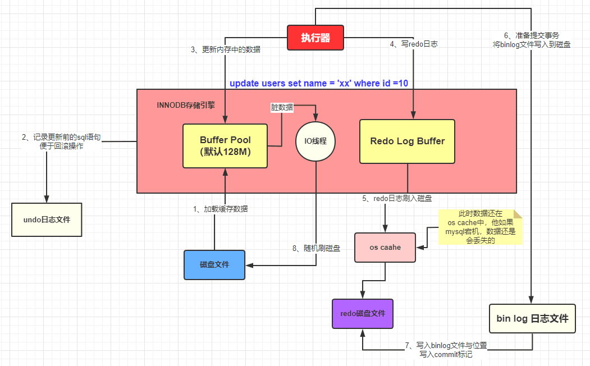

### 1.MySQL查询语句的执行过程
1、首先客户端与MySQL服务器建立连接，包括建立连接、管理连接、校验用户身份等
 
2、接着查询缓存，查询语句如果命中缓存则直接返回，否则继续执行（MySQL8.0已删除该模块）
 
3、通过解析器对查询语句进行词法分析、语法分析，然后构建语法树，方便后续模块读取表名、字段、语句类型
 
4、执行SQL，预处理阶段检查表或字段是否存在，优化阶段基于查询成本的考虑选择查询成本最小的执行计划，执行阶段根据执行计划执行SQL查询语句，从存储引擎读取记录，返回给客户端

### 2.更新一条数据到事务提交的流程描述
1、首先执行器根据MySQL的执行计划来查询数据，先是从缓存池中查询数据，如果没有就会去数据库中查询，如果查询到了就将其放到缓存池中
 
2、在数据被缓存到缓存池的同时，会写入undo log日志文件
 
3、更新的动作是在缓存池中完成的，同时会将更新后的数据添加到redo log buffer中
 
4、完成以后就可以提交事务，提交的同时会做以下三件事： 
 
4.1 将redo log buffer中的数据刷入到redo log文件中
 
4.2 将本次操作记录写入到binlog文件中
 
4.3将binlog文件名字和更新内容在binlog中的位置记录到redo log中，同时在redo log最后添加commit标记

### 3.什么是MVCC
全称多版本并发控制，一般在数据库管理系统中实现对数据库的并发访问，提升系统的性能。
 

MySQL的InnoDB引擎实现MVCC的三个基础点：
 
1.隐式字段：DB_ROW_ID是数据库默认为改行记录生成的唯一隐式主键；DB_TRX_ID是当前操作该记录的事务ID；而DB_ROLL_PTR是一个回滚指针，用于配合undo log，指向上一个旧版本。
 
2.undo log：不同事务或者相同事务对同一记录的修改，会导致该记录的undo log成为一条记录版本线性表，undo log的链首就是最新的旧记录，链尾就是最早的旧记录
 
3.ReadView：已提交读和可重复读的区别就在于它们生成ReadView的策略不同。
 
ReadView中有个列表存储我们系统中当前活跃着的读写事务，也就是开始了还未提交的事务。通过这个列表来判断记录的某个版本事务对当前事务可见。假设当前列表里的事务id为[80, 100]。
 
a. 如果你要访问的记录版本的事务id是50，比当前列表最小的id80小，那说明这个事务在之前就提交了，所以对当前活动的事务来说是可访问的
 
b. 如果你要访问的记录版本的事务id是90，发现此事务在列表id最大值和最小值之间，那就再判断一下是否在列表内，如果在那就说明事务还未提交，所以版本不能被访问；如果不在那说明事务已经提交，所以版本可以访问
 
c. 如果你要访问的记录版本的事务id是110，那比事务列表最大id都大，那说明这个版本是在ReadView生成之后才发生的，所以不能被访问
 
这些记录都是去undo log链里面找到，先找最近记录，如果最近这一条记录id不符合条件，不可见的话就再去找上一个版本再比较当前事务的id和这个版本事务id看能不能访问，以此类推直到返回可见的版本或者结束

#### 4、MySQL主从复制
主要涉及三个线程：binlog线程、I/O线程和SQL线程
 
> binlog线程：负责将主服务器上的数据更改写入二进制日志中
>  
> I/O线程：负责从主服务器上读取二进制日志，并写入从服务器的中继日志中
>  
> SQL线程：负责读取中继日志并重放其中的SQL语句
>  

全同步复制
 
主库写入binlog后强制同步日志到从库，所有的从库都执行完成后才返回给客户端，但是这种方式性能会受到严重影响
 
半同步复制
 
从库写入日志成功后返回ACK确认给主库，主库收到至少一个从库的确认就认为写操作完成

