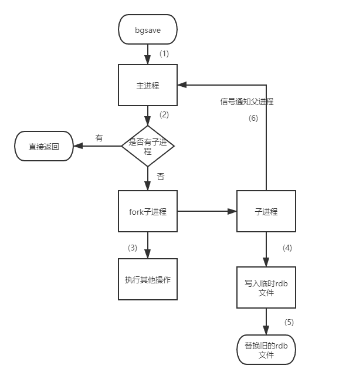
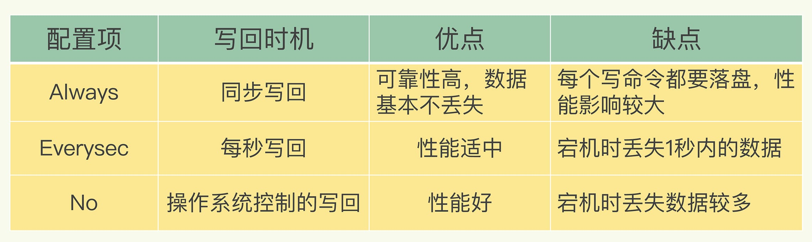
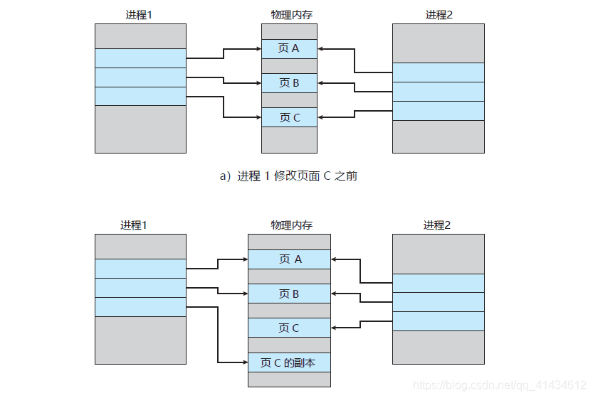
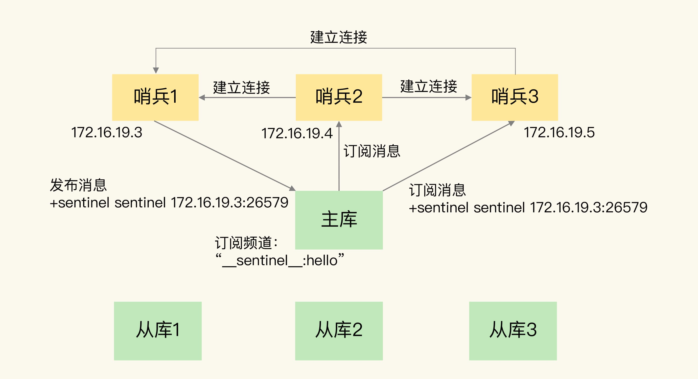
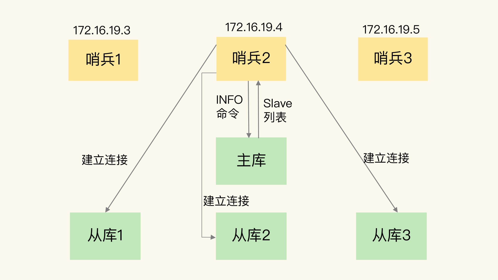
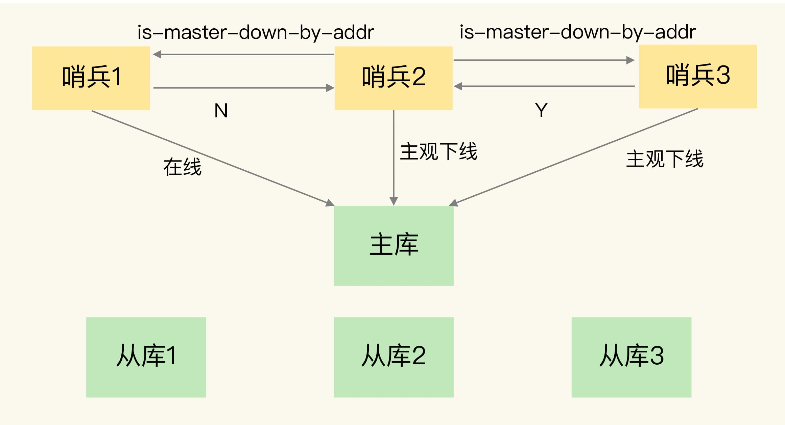
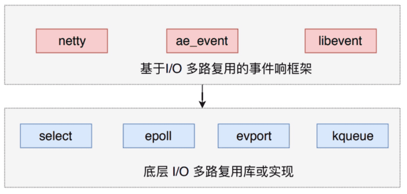
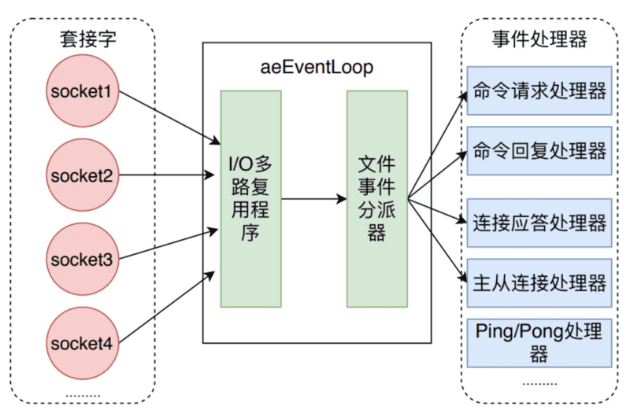
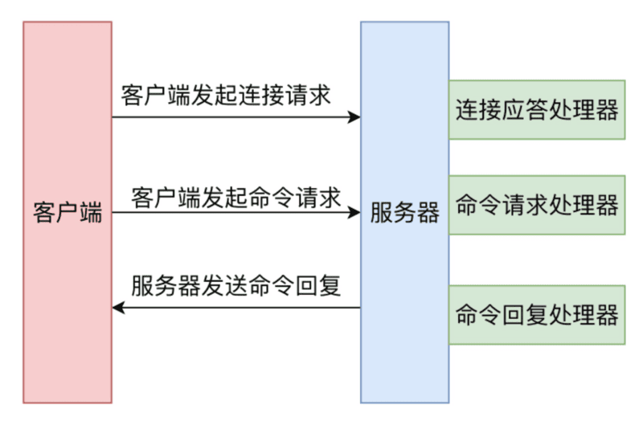

### 1、Redis持久化机制，优缺点

a. RDB持久化是把当前进程数据生成快照保存到磁盘上的过程；针对RDB
不适合实时持久化的问题，Redis提供了AOF持久化方式来解决
 
b. AOF是“写后”命令，Redis
先执行命令把数据写入内存，然后才记录日志。日志里记录的是Redis
收到的每一条命令，这些命令是以文本形式保存。
 
c. Redis4.
0提出了一个混合使用AOF
日志和内存快照的方法，内存快照以一定的频率执行，在两次快照之间，使用AOF
日志记录这期间的所有命令操作。
 
这样一来，快照不用很频繁的执行，可以避免频繁fork对主线程的影响。而且AOF
日志也只用记录两次快照间的操作，不需要记录所有操作，因此就不会出现文件过大的问题了。这个方法既能享受到RDB文件快速恢复的好处，又能享受到AOF只记录操作命令的简单优势，实际环境中用的最多

### 2、RDB触发方式

触发RDB持久化的方式有2种，分别是手动触发和自动触发
 
手动触发：
 
a. save命令：阻塞当前Redis服务器，直到RDB
过程完成为止，对于内存比较大的实例会造成长时间阻塞，线上环境不建议使用
 
b. bgsave命令：Redis进程执行fork操作创建子进程，RDB
持久化过程由子进程负责，完成后自动结束。阻塞只发生在fork阶段，一般时间很短
 

 
自动触发：
 
a. redis.conf配置save m n,
即在m秒内有n次修改时，自动触发bgsave生成RDB文件
 
b. 主从复制时，从节点要从主节点进行全量复制时也会触发bgsave操作，生成当时的快照发送到从节点
 
c. 执行debug reload命令重新加载redis时也会触发bgsave操作
 
d. 默认情况下执行shutdown命令时，如果没有开启AOF持久化，也会触发bgsave操作

### 3、RDB同步硬盘时怎样保证数据一致性

RDB中的核心思路是copy-on-write
，来保证在进行快照操作的这段时间，需要压缩写入磁盘上的数据在内存中不会发生变化。在正常的快照操作中，一方面Redis主进程会fork一个新的快照进程专门来做这个事情，这样保证了Redis服务不会停止对客户端包括写请求在内的任何响应。另一方面这段时间发生的数据变化会以副本的方式存放在另一个新的内存区域，待快照操作结束后才会同步到原来的内存区域。
 
举个例子：如果主线程对这些数据也是读操作（例如图中的键值对A），那么主线程和bgsave
子进程相互不影响。但是如果主线程要修改一块数据（例如图中的键值对C
），那么这块数据就会被复制一份，生成该数据的副本。然后bgsave
子进程会把这个副本数据写入RDB文件，而这个过程中主线程仍然可以直接修改原来的数据。
 

### 4、AOF为什么采用写后日志

Redis要求高性能，采用写后日志有两方面好处：
 
1、避免额外的检查开销：Redis在向AOF
里面记录日志的时候，并不会先去对这些命令进行语法检查。所以，如果先记日志再执行命令的话，日志中就有可能记录了错误的命令，Redis在使用日志恢复数据时就可能会出错
 
2、不会阻塞当前的写操作
 
但这种方式存在潜在风险：
 
1、如果命令执行完成，写日志之前宕机了，会丢失数据
 
2、主线程写磁盘压力大，导致写盘慢，阻塞后续操作

### 5、AOF是怎样实现的

AOF日志记录Redis的每个写命令，步骤分为：命令追加、文件写入和文件同步
 
1、命令追加：当AOF
持久化功能打开了，服务器在执行完一个写命令之后，会以协议格式将被执行的写命令追加到服务器的aof_buf缓冲区
 
2、文件写入和同步：关于何时将aof_buf缓冲区的内容写入AOF文件中，Redis
提供了三种写回策略：
 

 
a.always，同步写回：每个写命令执行完，立马同步的将日志写回磁盘
 
b.everysec，每秒写回：每个写命令执行完，只是先把日志写到AOF
文件的内存缓存区，每个一秒把缓冲区内容写入磁盘
 
c.no，操作系统控制的写回：每个写命令执行完，只是先把日志写到AOF
文件的内存缓冲区，由操作系统决定何时将缓冲区内容写回磁盘

### 6、AOF重写

#### 6.1、AOF重写会阻塞吗

AOF重写过程是由后台进程bgwriteaof来完成的。主线程fork
出后台的bgwriteaof子进程，fork会把主线程的内存拷贝一份给bgwriteaof
子进程，这里面就包含了数据库的最新数据。然后bgwriteaof
子进程就可以在不影响主线程的情况下，逐一把拷贝的数据写成操作，计入重写日志。所以AOF
重写时在fork进程时是会阻塞住主线程的。

#### 6.2、AOF日志重写时机

有两个配置项控制AOF重写的触发：
 
1、auto-aof-rewrite-min-size：表示运行AOF
重写时文件的最小大小，默认为64MB
 
2、auto-aof-rewrite-percentage：这个值的计算方式是当前AOF
文件大小和上一次重写后AOF文件大小的差值，再除以上一次重写后AOF文件大小。

#### 6.3、AOF重写时新数据写入问题

重写过程总结为：一个拷贝，两处日志。在fork
出子进程时的拷贝以及在重写时，如果有新数据写入，主线程就会将命令记录到两个AOF
日志内存缓冲区中。如果AOF写回策略配置的是always
，则直接将命令写回旧的日志文件，并且保存一份命令至AOF
重写缓冲区，这些操作对新的日志文件是不存在影响的。
 
在bgwriteaof
子进程完成对日志文件的重写操纵后，会提示主线程已经完成重写操纵，主线程会将AOF
重写缓冲区中的命令追加到新的日志文件后面。这时候在高并发的情况下，AOF
重写缓冲区积累可能会很大，这样就会造成阻塞，Redis后面通过Linux管道技术让AOF
重写期间就能同时进行回放，这样AOF重写结束后只需回放少量剩余的数据即可。
 
最后通过修改文件名的方式，保证文件切换的原子性。在AOF
重写日志期间发生宕机的话，因为日志文件还没切换，所以恢复数据时，用的还是旧的日志文件。

#### 6.4、主线程fork出子进程时如何复制内存数据的

fork
采用操作系统提供的写时复制机制，就是为了避免一次性拷贝大量内存数据给子进程造成阻塞。fork
子进程时，子进程会拷贝父进程的页表，即虚拟映射关系（虚拟内存和物理内存的映射索引表），而不会拷贝物理内存。这个拷贝会消耗大量CPU资源，并且拷贝完成前会阻塞主线程，阻塞时间取决于内存中的数据量，数据量越大则内存页表越大。拷贝完成后，父子进程使用相同的内存地址空间。
 
但主进程是可以有数据写入的，这时候就会拷贝物理内存中的数据。如下图（进程1看作是主进程，进程2
看作是子进程）：
 

 
但主进程有数据写入时，而这个数据刚好在页C中，操作系统会创建这个页面的副本（页C
的副本），即拷贝当前页的物理数据，将其映射到主进程中，而子进程还是使用原来的页C。

#### 6.5、AOF重写过程中主线程哪些地方会阻塞

1、fork子进程时，需要拷贝虚拟页表，会对主线程阻塞
 
2、主进程有大key写入时，操作系统会创建页面的副本，并拷贝原有的数据，会对主线程阻塞
 
3、子进程重写日志完成后，主线程追加AOF重写缓冲区时可能会对主线程阻塞

### 7、Redis集群的主从复制

主从复制，是指将一台Redis服务器的数据复制到其他的Redis
服务器。前者称为主节点，后者称为从节点。数据的复制时单向的，只能由主节点到从节点
 
主从复制的作用包括：
> 1、数据冗余：主从复制实现了数据的备份，是持久化之外的一种数据冗余方式
>  
> 2、故障恢复：当主节点出现问题时，可以由从节点提供服务，实现快速地故障恢复，实际上是一种服务的冗余
>  
> 3、负载均衡：在主从复制的基础上，配合读写分离，可以由主节点提供写服务，从节点负责读服务，分担服务器负载
>  
> 4、高可用基石：除了上述作用以外，主从复制还是哨兵和集群能够实施的基础，因此说主从复制是Redis高可用的基石

主从复制支持全量复制和增量复制

#### 7.1、全量复制流程

 
1、第一阶段是主从库间建立连接、协商同步的过程，主要是为全量复制做准备。在这一步，从库和主库建立起连接，并告诉主库即将进行同步，主库确认回复后，主从库间就可以开始同步了。
> 具体来说，从库给主库发送psync
> 命令，表示要进行数据同步，主库根据这个命令的参数来启动复制。psync
> 命令包含了主库的额runId和复制进度offset两个参数。runId是每个Redis
> 实例启动时自动生成的随机id
> ，用来唯一标记这个实例。当从库和主库第一次复制时，因为不知道主库的runId
> ，所以将runId设为"?"，offset设为-1，表示第一次复制。主库收到psync
> 命令后，会用FULLRESYNC响应命令带上两个参数：主库runId
> 和主库目前的复制进度offset
> ，返回给从库。从库收到响应后会记录下这两个参数。FULLRESYNC
> 响应表示第一次复制采用的全量复制，也就是说主库会把当前所有的数据都复制给从库。

2、第二阶段，主库将所有数据同步给从库。从库收到数据后，在本地完成数据加载。这个过程依赖于内存快照生成的RDB文件。
> 具体来说，主库执行basave命令，生成RDB文件，接着将文件发给从库。从库接收到RDB
> 文件后，会先清空当前数据库，然后加载RDB文件。这是因为从库在通过replicaof
>
命令开始和主库同步前，可能保存了其他数据。为了避免之前数据的影响，从库需要先把当前数据库清空。在主库将数据同步给从库的过程中，主库不会被阻塞，仍然可以正常接收请求。否则，Redis的服务就被中断了。但是这些请求中的写操作并没有记录到刚刚生成的RDB文件中。为了保证主从库数据的一致性，主库会在内存中用专门的replication
buffer，记录RDB文件生成后收到的所有写操作。

3、第三个阶段，主库会把第二阶段执行过程中收到的写命令，再发送给从库。
> 具体的操作是，当主库完成RDB文件发送后，会把此时replication
> buffer中的修改操作发给从库，从库再重新执行这些操作，这样一来主从库就实现同步了

#### 7.2、增量复制流程

如果主从库在命令传播时出现了网络闪断，那么从库就会和主从重新进行一次全量复制，开销非常大。从Redis2.8开始，网络断了之后主从库会采用增量复制的方式继续同步
 

 
repl_backlog_buffer：
> 它是为了从库断开之后，如何找到主从差异数据而设计的环形缓冲
>
区，从而避免全量复制带来的性能开销。如果从库断开时间太久，repl_backlog_buffer环形缓冲区被主库的写命令覆盖了，那么从库连上主库后只能进行一次全量复制。所以repl_backlog_buffer配置尽量大一些，可以降低主从断开后全量复制的概率。而在repl_backlog_buffer中找主从差异的数据后，如何发给从库呢？这就用到了replication
buffer
 

replication buffer：
> Redis和客户端通信也好，和从库通信也好，Redis都需要分配一个内存buffer
> 进行数据交互，客户端是一个client，从库也是一个client，我们每个client
> 连上Redis后，Redis都会分配一个client
> buffer，所有数据交互都是通过这个buffer进行的：Redis
> 先把数据写到这个buffer中，然后再把buffer中的数据发到client
> socket
> 中再通过网络发送出去，这样就完成了数据交互。所以主从增量同步时，从库作为一个client
> ，也会分配一个buffer，只不过这个buffer
> 专门用来传播用户的写命令到从库，保证主从数据一致，我们通常把它叫做replication
> buffer

### 8、Redis哨兵模式

#### 8.1、哨兵实现了什么功能

1、监控：哨兵会不断地检查主节点和从节点是否运作正常
 
2、自动故障转移：当主节点不能正常工作时，哨兵会自动故障转移操作，它会将失效主节点的其中一个从节点升级为新的主节点，并让其他从节点改为复制新的主节点
 
3、配置提供者：客户端在初始化时，通过连接哨兵来获得当前Redis服务的主节点地址
 
4、哨兵可以将故障转移的结果发送给客户端

#### 8.2、Redis哨兵集群通过什么方式组建

哨兵实例之间可以相互发现，要归功于Redis提供的pub/sub机制，也就是发布/订阅机制。
 
在主从集群中，主库有一个名为_sentinal_:hello
的频道，不同哨兵就是通过它来相互发现，实现互相通信的。在下图中，哨兵1把自己的IP(172.
161.19.3)和端口(26579)
发布到_sentinal_:hello频道上，哨兵2和3订阅了该频道。那么此时，哨兵2和3
就可以从这个频道直接获取哨兵1的IP地址和端口号，然后哨兵2、3就可以和哨兵1建立网络连接。
 

 
通过这个方式，哨兵2和3
也可以建立网络连接，这样一来哨兵集群就形成了。它们互相间可以通过网络连接进行通信，比如说对主库有没有下线这件事进行判断和协商。

#### 8.3、Redis哨兵是如何监控Redis集群的

这是由哨兵向主库发送INFO命令来完成的。如下图所示，哨兵2向主库发送INFO
命令，主库接收到这个命令后，就会把从库列表返回后哨兵。接着，哨兵就可以根据从库列表中的连接信息，和每个从库建立连接，并在这个连接上持续的对从库进行监控。哨兵1和3可以通过相同的方法和从库建立连接。
 

#### 8.4、Redis哨兵如何判断主库已经下线

1、主观下线：任何一个哨兵都是可以监控监测，并做出Redis节点下线的判断
 
2、客观下线：由哨兵集群共同决定Redis节点是否下线
 
当某个哨兵（如下图中的哨兵2）判断主库主观下线后，就会给其他哨兵发送is-master
-down-by-addr命令。接着其他哨兵会根据自己和主库的连接情况，做出Y或N的响应，Y
相当于赞成票，N相当于反对票。如果赞成票数（这里是2）是大于等于哨兵配置文件中quorum
配置项（比如quorum=2），则可以判断主库客观下线了。
 

#### 8.5、Redis哨兵的选举机制是怎样的

为了避免哨兵的单点情况发生，所以需要一个哨兵的分布式集群。作为分布式集群，必然涉及共识问题（即选举问题），同时故障的转移和通知都只需要一个主的哨兵节点就可以了。
 
哨兵的选举机制：
> Raft选举算法：选举的票数大于等于num(sentinals)
> /2+1时，将成为领导者，如果没有超过继续选举

任何一个想成为leader的哨兵，需要满足两个条件：
> a.拿到半数以上的赞成票
>  
> b.拿到的票数同时还需要大于等于哨兵配置文件中的quorum值

以3个哨兵为例，假设此时的quorum=2，那么任何一个想成为leader的哨兵只需拿到2
张赞成票就可以了。

### 9、Redis文件事件的模型

Redis基于Reactor
模式开发了自己的网络事件处理器，也就是文件事件处理器。文件事件处理器使用IO
多路复用技术，同时监听多个套接字，并为套接字关联不同的事件处理函数。当套接字的可读或者写事件触发时，就会调用相应的事件处理函数。

#### 9.1、为什么单线程Redis那么快

Redis的瓶颈主要是IO而不是CPU，所以6.
0版本前是单线程模型；其次，Redis单线程主要是指Redis的网络IO
和键值对读写是由一个线程来完成的，这也是Redis
对外提供键值存储服务的主要流程。（但Redis
的其他功能比如持久化、异步删除、集群同步等都是由额外的线程执行的）。
 
Redis采用了多路复用机制使其在网络IO操作中能并发处理大量的客户端请求，实现高吞吐率。

#### 9.2、Redis事件相应框架ae_event及文件事件处理器

Redis并没有使用libevent或者libev
这样的成熟开源方案，而是自己实现一个非常简洁的时间驱动库ae_event。
 
Redis使用的IO多路复用技术主要由：select、epoll、evport和kqueue
等。每个IO多路复用函数库在Redis源码中都对应一个单独的文件，比如ae_event.
c，ae_epoll.c，ae_kqueue.
c等。Redis
会根据不同的操作系统，按照不同的优先级选择多路复用技术，事件相应框架一般都采用该架构，比如netty和libevent。
 

 
如下图所示，文件事件处理器有四个组成部分，它们分别是套接字、I/O
多路复用程序、文件事件分派器以及事件处理器。
 

 
文件事件是对套接字操作的抽象，每当一个套接字准备好执行accept、read、write
和close等操作时，就会产生一个文件事件。因为Redis
通常会连接多个套接字，所以多个文件事件有可能并发的出现。
 
IO多路复用程序负责监听多个套接字，并向文件事件分派器传递那些产生了事件的套接字。
 
尽管多个文件事件可能会并发的出现，但IO
多路复用程序总是会将所有产生的套接字都放到同一个队列里边，然后文件事件处理器会以有序、同步、单个套接字的方式处理该队列中的套接字，也就是处理就绪的文件事件。
 

### 10、Redis6.0

#### 10.1、Redis6.0之前版本真的是单线程吗

Redis在处理客户端请求时，包括获取（socket读）、解析、执行、内容返回（socket
写）等都是由一个顺序串行的主线程执行的，这就是所谓的单线程。但如果严格讲，从Redis4.
0之后并不是单线程，除了主线程之外，也有后台线程在处理一些较为缓慢的操作，例如清理脏数据、无用链接的释放、大key的删除、数据持久化bgsave、bgwriteaof等，都是在主线程之外的子线程单独执行的。

#### 10.2、Redis6.0之前为什么不用多线程

Redis
主要受限于内存和网络。例如在一个普通的Linux
系统上，Redis通过使用pipelining
美妙可以处理100万个请求，所以如果应用程序主要使用O
(N)或O(log(N))的命令，它几乎不会占用太多CPU；
 
使用了单线程后，可维护性高。多线程模型虽然在某些方面表现优异，但是它却引入了程序执行顺序的不确定性，带来了并发读写的一系列问题，增加了系统的复杂度、同时可能存在线程切换、甚至加锁解锁、死锁造成的性能损耗。Redis通过AE事件模型以及IO多路复用等技术，处理性能非常高，因此没有必要使用多线程。单线程机制使得Redis内部实现的复杂度大大降低，Hash的惰性Rehash、Lpush等等线程不安全的命令都可以无锁进行。

#### 10.3、Redis6.0为什么引入多线程

Redis
将所有数据放在内存中，内存的响应时长大约为100
纳秒，对于小数据包，Redis服务器可以处理80000
到10000QPS，这也是Redis
处理的极限，对于80%的公司来说，单线程的Redis
已经足够使用了。
 
但随着越来越复杂的业务场景，有些公司动不动就上亿的交易量，因此需要更大的QPS。常见的解决方案是在分布式架构中对数据进行分片并采用多个服务器。但该方案有非常大的缺点，例如要管理的Redis服务器太多，维护代价大；某些适用于单个Redis服务器的命令不适用于数据分区；数据分区无法解决热点读/写问题；数据倾斜，重新分配和放大/缩小变得更加复杂等。
 
从Redis自身角度来说，因为读写网络的read
/write系统调用占用了Redis执行期间大部分CPU时间，瓶颈主要在于网络的IO消耗，优化主要有两个方向：
 
> 提高网络IO性能，典型的实现比如使用DPDK来代替内核网络栈的方式
>  
> 使用多线程充分利用多核，典型的实现比如Memcached

协议栈优化的这种方式跟Redis关系不大，支持多线程是一种最有效最便捷的操作方式。所以总结起来，Redis支持多线程
主要就是这两个原因：
 
> 可以充分利用服务器CPU资源，目前主线程只能利用一个核
>  
> 多线程任务可以分摊Redis同步IO读写负荷

#### 10.3、Redis6.0多线程的实现机制
核心思路是将主线程IO读写任务拆分出来给一组独立的线程执行，使得多个socket的读写可以并行化
 
> 1、主线程负责接收建立连接的请求，获取socket放到全局等待队列
>  
> 2、主线程处理完读事件之后，通过Round Robin将这些连接分配给IO线程(并不会等待队列满)
>  
> 3、主线程阻塞等待IO线程读取socket完毕
>  
> 4、主线程通过单线程的方式执行请求命令，请求数据读取并解析完成，但并不执行
>  
> 5、主线程阻塞等待IO线程将数据回写socket完毕
>  
> 6、解除绑定，清空等待队列

该线程有如下特点：
 
> IO线程要么同时在读socket，要么同时在写，不会同时读和写
>  
> IO线程只负责读写socket解析命令，不负责命令处理(主线程串行执行命令)

#### 10.5、开启多线程后是否存在线程并发安全问题
Redis多线程部分只是用来处理网络数据的读写和协议解析，执行命令仍然是单线程顺序执行，因此不存在线程的并发安全问题
